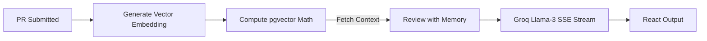

# 🛡️ Omni-SRE — Context-Aware Code Review & Security Agent

> **An AI agent that doesn't just review code — it *remembers* your team's history.**

[](https://groq.com)
[](https://supabase.com)
[](https://fastapi.tiangolo.com)

---

## 🌩️ Overview

Generic AI linters produce the same textbook suggestions for every team. They don't know that:
- Your team already had a **production injection vulnerability** last month
- You established a **mandatory safe-query helper** after that incident
- A senior developer **rejected** the exact same pattern in PR #51

**Omni-SRE fixes this** by giving your AI code reviewer persistent, institutional memory built directly on top of the ultra-fast **Supabase pgvector** architecture.

### The Memory Loop



## 🧠 Complete Architecture Migration

Omni-SRE has been fully modernized and hardened for scale and determinism:

| Layer | Technology | Purpose |
|-------|-----------|---------|
| **Frontend UI** | React + Vite | Realtime dashboard, streaming review viewer |
| **Logic Brain** | Python FastAPI | Core engine replacing the legacy Node.js/Express backend |
| **Streaming** | Server-Sent Events (SSE) | Realtime chunk streaming natively connected to the UI |
| **LLM Inference** | Groq (`llama-3.1-8b-instant`) | Blazing fast contextual code agent |
| **Embeddings** | `sentence-transformers` | Zero-API-Cost local encoding (`all-MiniLM-L6-v2`) |
| **Database & Auth** | Supabase (PostgreSQL) | Native Vector math (`pgvector`), OAuth, and strict RLS |

### Architecture Flow

```
┌─────────────┐     ┌───────────────────────┐
│   React UI  │────▶│   Python API Gateway  │
│   :5173     │     │   FastAPI :8000       │
└─────────────┘     └───────────┬───────────┘
                                │       
                     ┌──────────▼──────────┐
                     │ Supabase pgvector   │
                     │ Strict RLS Secured  │
                     └─────────────────────┘
```

## 🔒 Security First: Multi-Factor Resilience

Omni-SRE ensures your reviews and memories are bulletproof:

**1. Row Level Security (RLS)**
Workspaces and reviews are securely hard-gated by JWT token verification directly inside the Python backend. Cross-tenant access is physically impossible at the database level.

**2. Dynamic RAG Failsafes**
If `pgvector` math encounters an empty vector matrix (e.g., when a user submits an incident through the frontend without backend vectorization), Omni-SRE instantly executes an **Absolute CRUD Fallback**, ensuring the LLM always receives relevant Workspace context.

**3. Automatic Vector Backfill**
Omni-SRE automatically heals itself. A discrete endpoint continually scans for `NULL` dimension bindings and dynamically maps text down into dense 384-dimensional latent semantic space.

## 🚀 Quick Start

### 1. Define Environment
Create `.env` within the `client/` and project root directories. You need:
- `VITE_SUPABASE_URL`
- `VITE_SUPABASE_ANON_KEY`
- `SUPABASE_SERVICE_ROLE_KEY`
- `GROQ_API_KEY`

### 2. Stand Up the Matrix

**Terminal 1: Setup React**
```bash
cd client
npm install
npm run dev
```

**Terminal 2: Launch the Brain**
```bash
cd backend
python -m venv venv
venv\Scripts\activate  # Windows
pip install -r requirements.txt
uvicorn main:app --port 8000
```

### 3. Open the Operations Deck
Navigate to `http://localhost:5173`. Authorize your GitHub OAuth token, drop a diff, and witness Agentic Memory.

## 🛡️ Omni-SRE: Automated AI Code Reviews
With the newly integrated **GitHub Webhook Pipeline**, Omni-SRE now automatically audits your Pull Requests in real-time. It uses your team's unique institutional memory to find security risks that generic AI tools miss.

---
*Omni-SRE: The Context-Aware SRE Agent.*
