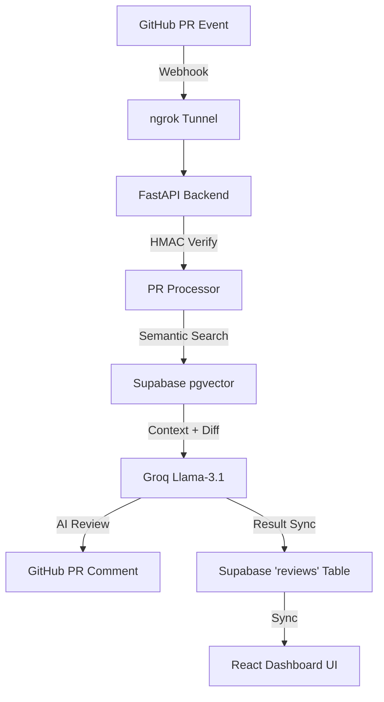

# 🛡️ Omni-SRE — Context-Aware Code Review & Security Agent

> **An AI agent that doesn't just review code — it *remembers* your team's history.**

[](https://groq.com)
[](https://supabase.com)
[](https://fastapi.tiangolo.com)

---

## 🌩️ Overview

Omni-SRE is a next-generation CI/CD security agent designed to eliminate "generic" AI noise. Most AI linters give textbook advice; Omni-SRE uses **Institutional Memory** to catch bugs based on your team's specific past failures, established patterns, and rejected PRs.

### Core Features
- **Deterministic RAG**: Combines `pgvector` semantic search with an Absolute CRUD Fallback for 100% context reliability.
*   **GitHub Webhook Integration**: Automated, real-time PR auditing via secure HMAC-verified tunnels.
*   **Vector Auto-Healing**: Background workers automatically vectorize missing data to keep the memory bank up to date.
*   **Premium Dashboard**: Real-time analytics on security findings and institutional memory hits.

---

## 🧠 Architecture



---

## 🚀 Quick Start Guide

Follow these steps to set up Omni-SRE from scratch.

### 1. Prerequisites
- **Node.js**: 18.x or higher
- **Python**: 3.10 or higher
- **Supabase**: A project with `pgvector` enabled.
- **ngrok**: For local webhook testing.
- **Groq API Key**: For blazing-fast LLM inference.

### 2. Database Setup (Supabase)
Run the following SQL scripts in your Supabase SQL Editor in order:
1.  **[supabase_schema.sql](./supabase_schema.sql)**: Core tables and RLS.
2.  **[pgvector_setup.sql](./pgvector_setup.sql)**: Vector extension and index.
3.  **[create_reviews_table.sql](./create_reviews_table.sql)**: Hardened persistence layer.
4.  **[workspace_settings.sql](./workspace_settings.sql)**: Repository-to-Workspace mapping.

### 3. Environment Configuration
Create a `.env` file in the **project root** and **client/** directory:

**Backend / Root `.env`**
```env
VITE_SUPABASE_URL=your_project_url
VITE_SUPABASE_ANON_KEY=your_anon_key
SUPABASE_SERVICE_ROLE_KEY=your_service_role_key (CRITICAL)
GROQ_API_KEY=your_groq_key
GITHUB_WEBHOOK_SECRET=your_chosen_secret
GITHUB_PERSONAL_ACCESS_TOKEN=your_ghp_token
```

**Frontend `client/.env`**
```env
VITE_SUPABASE_URL=your_project_url
VITE_SUPABASE_ANON_KEY=your_anon_key
```

### 4. Running the Platform

**Terminal 1: Start the Dashboard**
```bash
cd client
npm install
npm run dev
```

**Terminal 2: Start the AI Engine**
```bash
cd backend
python -m venv venv
venv\Scripts\activate  # Windows
# source venv/bin/activate # Mac/Linux
pip install -r requirements.txt
uvicorn main:app --port 8000 --reload
```

**Terminal 3: Start the Bridge (ngrok)**
```bash
ngrok http --url=your-assigned-domain.ngrok-free.dev 8000
```

---

## 🛡️ Webhook Configuration
To enable automated PR reviews:
1.  Go to your GitHub Repository **Settings > Webhooks > Add Webhook**.
2.  **Payload URL**: `https://your-domain.ngrok-free.dev/api/github/webhook`
3.  **Content Type**: `application/json`
4.  **Secret**: Insert your `GITHUB_WEBHOOK_SECRET`.
5.  **Events**: Select **Pull Requests**.

---

## 🔒 Security
- **HMAC Validation**: Every incoming webhook is cryptographically verified.
*   **Tenant Isolation**: Database-level RLS ensures users only see data belonging to their workspaces.
*   **Service-Level Auth**: The background worker uses Service Role keys to ensure reliability without session timeouts.

---
*Omni-SRE: The Context-Aware SRE Agent.*
