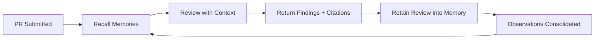

# 🛡️ Omni-SRE — Context-Aware Code Review & Security Agent

> **An AI agent that doesn't just review code — it *remembers* your team's history.**

[](https://devpost.com)
[](https://groq.com)
[](https://vectorize.io)

---

## The Problem

Generic AI linters produce the same textbook suggestions for every team. They don't know that:
- Your team already had a **production NoSQL injection** last month
- You established a **mandatory safe-query helper** after that incident
- A senior developer **rejected** the exact same pattern in PR #51

**Omni-SRE fixes this** by giving your AI code reviewer persistent, institutional memory powered by **Vectorize Hindsight**.

## How It Works

```
Day 1: Agent gives generic "validate input" advice (any AI can do this)
        ↓ learns from merged PRs, incidents, conventions ↓
Week 3: Agent says "This EXACT pattern caused INC-012 (2.5hr downtime). 
         Use safeFindMany() from /lib/db/safe-query.js per team policy."
```

### The Memory Loop



1. **Recall** — Multi-pass retrieval from Hindsight (security incidents → file history → conventions)
2. **Review** — Groq LLM analyzes diff with injected memory context
3. **Retain** — Review results are stored back into memory
4. **Learn** — Hindsight's observation consolidation synthesizes patterns over time

## 🔑 Hindsight Integration (25% of judging)

We use all three core Hindsight operations:

| Operation | Usage | Why |
|-----------|-------|-----|
| `retain()` | Ingest PR reviews, incidents, conventions with context tags & entities | Builds structured, queryable team memory |
| `recall()` | Multi-pass retrieval (security → file history → conventions) with TEMPR | Gets the *right* memories, not just similar text |
| `reflect()` | Agentic reasoning over recalled memories | Connects patterns humans might miss |

### Memory Bank Design
- **One bank per workspace** — complete memory isolation between teams
- **Tuned disposition** — high skepticism (don't accept patterns at face value), high literalism (be precise about what happened)
- **Observation consolidation** — After 4+ related facts, Hindsight synthesizes higher-level observations

### Content Types Retained

| Type | Context Tag | Example |
|------|-------------|---------|
| PR Reviews | `"pr-review"` | "PR #55 rejected: raw MongoDB .find() used" |
| Security Incidents | `"security-incident"` | "INC-012: NoSQL injection via unsanitized $where" |
| Team Conventions | `"team-convention"` | "All queries must use safeFindMany()" |
| Architecture Decisions | `"architecture-decision"` | "ADR-3: Adopted express-mongo-sanitize globally" |

## Tech Stack

| Layer | Technology | Purpose |
|-------|-----------|---------|
| Frontend | React + Vite | Dashboard, review viewer, incident logger |
| Backend API | Node.js + Express | Auth, CRUD, webhook ingestion |
| AI Engine | Python + FastAPI | Agentic review orchestration |
| LLM | Groq (qwen3-32b) | High-speed inference with tool-use |
| Memory | Vectorize Hindsight | Persistent agentic memory |
| Database | MongoDB | Application state |

## Architecture

```
┌─────────────┐     ┌──────────────┐     ┌─────────────────┐
│   React UI  │────▶│  Node.js API │────▶│  Python AI      │
│   :5173     │     │  :3001       │     │  Engine :8000   │
└─────────────┘     └──────────────┘     └───────┬─────────┘
                           │                     │       │
                    ┌──────▼──────┐    ┌─────────▼──┐  ┌─▼────────┐
                    │  MongoDB    │    │  Hindsight  │  │  Groq    │
                    │  :27017     │    │  :8888      │  │  Cloud   │
                    └─────────────┘    └─────────────┘  └──────────┘
```

## Quick Start

### Prerequisites
- Docker & Docker Compose
- Node.js 20+
- Python 3.12+
- Groq API key ([get one free](https://console.groq.com))

### 1. Clone & Configure
```bash
git clone https://github.com/your-org/Omni-SRE.git
cd Omni-SRE
cp .env.example .env
# Edit .env with your GROQ_API_KEY and HINDSIGHT_API_LLM_API_KEY
```

### 2. Start with Docker Compose
```bash
docker-compose up -d
```

### 3. Or Run Locally (Development)
```bash
# Terminal 1: Hindsight + MongoDB
docker-compose up hindsight mongo -d

# Terminal 2: Node.js Backend
cd server && npm install && npm run dev

# Terminal 3: Python AI Engine
cd ai-engine && pip install -r requirements.txt && python -m app.main

# Terminal 4: React Frontend
cd client && npm install && npm run dev
```

### 4. Open the Dashboard
Navigate to `http://localhost:5173`. Register, create a workspace, and trigger your first review.

## Demo Flow — The "Learning Curve"

1. **Baseline Review** — Paste a diff with a raw MongoDB `.find()`. Agent flags it as a generic MEDIUM.
2. **Log Incident** — Record INC-012 (NoSQL injection) via the Incident form. It's retained into Hindsight.
3. **Add Convention** — "All queries must use safeFindMany()". Retained into memory.
4. **Breakthrough Review** — Paste a similar diff. Agent now flags it as CRITICAL, citing INC-012 and the team convention.

## LLM Error Resilience

Three-tier strategy ensuring reviews **always return something**:

1. **Retry with correction** — If Groq function call returns bad JSON, retry with corrective prompt (3x)
2. **Model fallback** — If primary model fails, switch to `openai/gpt-oss-120b`
3. **Plain text fallback** — Strip function calling, request JSON in plain text, parse with regex

## Project Structure

```
Omni-SRE/
├── client/          # React + Vite frontend
├── server/          # Node.js + Express backend
├── ai-engine/       # Python + FastAPI AI engine
├── docker-compose.yml
└── .env.example
```

## Team

Built by **Nihan Ahmad** for the Microsoft × Vectorize Hindsight Hackathon.

## License

MIT
